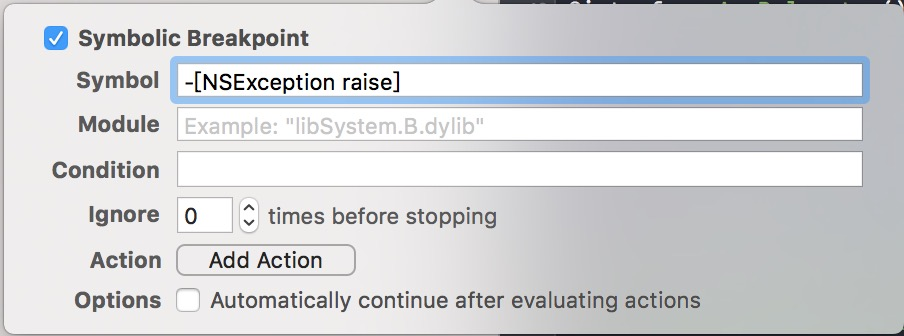
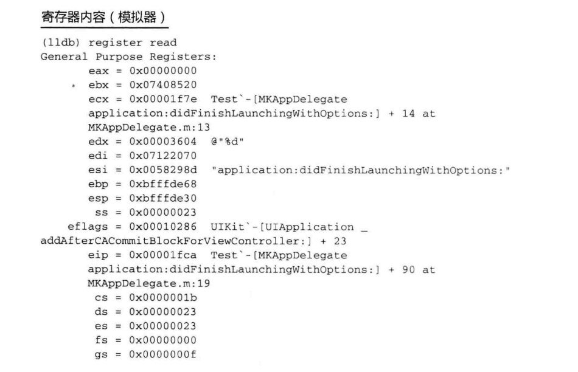
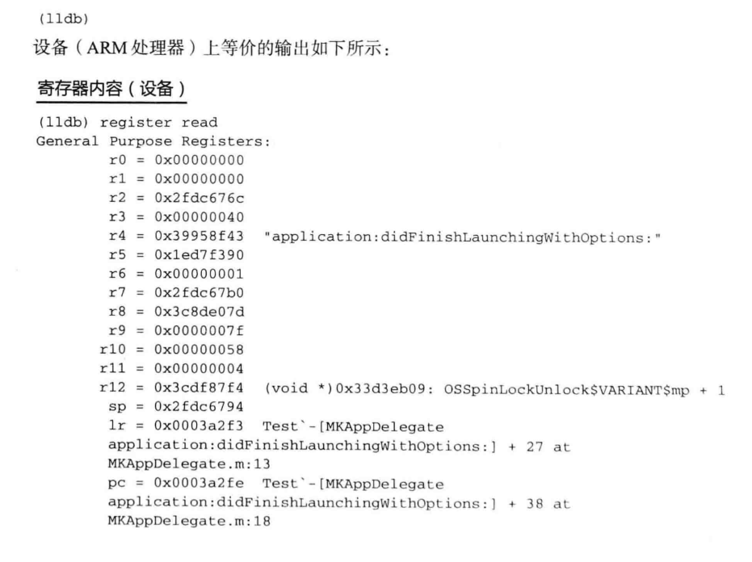

## 1.LLDB
LLDB是LLVM中可重用组建构建的下一代高性能调试器，包括完整的LLVM编译器，其中就有LLVM的Clang表达式解析器和反汇编程序。对我们开发人员拉说意味着LLDB能理解你的编译器所能理解的语法。
## 2.使用LLDB进行调试
使用LLDB进行调试跟GDB的差别微乎其微，了解LLDB内部的工作机制及带来的细微差异，能让你成为更好的开发人员。

###2.1 **dSYM文件**

调试信息文件（dsYM）中存储着与目标有关的调试信息。调试器通常集成在开发环境中，开发环境中通常支持放置断点使应用停止运行，从而查看代码中变量的值，有两种调试器：机器语言调试器能够运行到断电时显示逆向过来的汇编代码，允许你观察寄存器中的值，汇编人员通常使用这种调试器。符号调试器能够在调试代码时显示应用中使用的符号或变量，跟机器语言调试器不同，符号调试器语序你查看代码中的符号，而不是寄存器中和内存地址。

让符号调试器工作起来，需要一个编译过的代码和你编写源代码之间的链接或者映射，这正是调试信息文件中所包含的内容。调试器能够参考调试信息文件，根据你在源代码中放置的断点让应用程序停在正确的位置。Xcode的调试信息文件被称作为dSYM文件（因为文件扩展名为.dsYM）。

###2.2 **符号化**

LLVM在内的编译器都是用来将源代码转为汇编代码的。所有汇编代码都有一个基地址，你定义的变量，用到的堆和栈都依赖这个基地址。每次运行时，这个基地址都会变。符号化使用方法名和变量名来替换基地址的过程，基地址是应用的入口地址，可以符号化其他符号，方法就是计算它们相对于基地址的偏移，然后将他们映射到dSYM文件中。符号化的过程在用Xcode调试应用进行，或者用Instruments做性能分析时进行。

* Xcode的符号化

我们快速的看一下Xcode创建的xcarchive包，它里面包含如下目录：dSYMs、Products以及一个Info.plist文件，dSYMs目录含有工程中包含的目标/静态库对应的所有dSYM文件。Products目录含有所有的可执行二进制文件。Info.plist与工程中的plist文件相同，当你将从iTunesConnect中得到的.crash文件拖到Xcode中时，Xcode内部会查找归档文件，找出与崩溃报告匹配的info.plist文件，然后从哪个归档文件的dYSMs目录获取.dYSM文件。这就是不能删除已提交归档文件的原因。如果在应用提交之后就删除了这些归档文件，那么当你尝试对一个崩溃报告进行符号化时，很有可能陷入困境。

* 将dSYM提交到版本控制系统中

另一个存储dSYM的方法是将他们提交到版本控制系统中，这样在我们拿到崩溃报告时，可以检验跟提交的版本对应的dSYM,并通过匹配崩溃报告和dSYM对崩溃报告进行符号化。这样团队中所有的开发人员都能够访问dSYM文件，而对崩溃调试则可以有任何团队成员来完成。

###2.3 断点导航面板
可以使用Cmd + 6来快速访问断点导航面板，支持为异常和符号设置断点

* **异常断点**

在代码有问题导致跑出异常时，异常断点会终止程序的执行，Foundation.framework的NSArray,UIKit类中的一些方法会在不满足特定条件下抛出异常。例如数组越界，UitableView会在会在行数声明为“n”,而没有为每行提供单元格时抛出异常。调试异常在理论上比较容易，但理解造成异常的源相当复杂。应用在崩溃时只会在日志中显示造成崩溃的那条异常，但Foundation.framework方法会在整个工程中都用到，不撤职断点，即时看了日志也不知道发生了什么，设置了断点后，调试器会在异常抛出的瞬间暂停程序的执行，但在捕获异常之前，你需要在断点导航面板中查看崩溃了的那个线程的站轨迹。

* **符号断点**

符号断点会在执行到特定符号时暂停程序。符号可以是一个方法名，类中的一个方法或者任何c方法（obj_msgSend）。

`malloc_error_break`和` -[NSObject doesNotRecognizeSelector]`对调试跟内存相关的崩溃很有帮助，如果应用崩溃了并抛出EXC_BAD_ACCESS，那么在其中一个或全部两个符号上设置断点能狗帮助你定位问题。

* 编辑断点

开发者创建的每个断点都可以在导航面板中修改。按住Ctrl并点击断点，然后在菜单中选择Edit Breakpoint的方式来编辑断点。你会看到一个断点编辑页，通常断点会在每次执行到该行时停止程勋的执行，你可以编辑断点设置一个条件，从而创建一个条件断点，只有在满足条件时，该断点才会执行。

###2.4 LLDB控制台

当断点暂停应用时，可以在调试控制条输入LLDB调试命令，最常用的是po,意为打印对象。处理整形或者机构体型标量时，要用p,而不是po,后跟结构体的类型，例如：`p self.view.center`还可以打印寄存器的值：

`register read`

你的控制台应该显示类似下面的输出：
 
;
;

我们只需注意模拟器中的eax,ecx和esi,或者设备上的r0~r4寄存器，这些寄存器保存我们感兴趣的值，而ecx保存的是我们最后调用的选择器，如果选择器参数多于3个，那么它们会保存在栈中，通过栈指针（r13）可以访问。

* 崩溃日志分析
 
崩溃报告中含有寄存器的状态
日志存放的路径
模拟器存放路径：`~/Library/Logs/DiagnosticReports/`

真机设备存放路径：` ~/Library/Logs/CrashReporter/MobileDevice/`前提是设备连接了Xcode。

我们需要对这些日志符号化，利用symbolicatecrash对脚本符号化
symbolicatecrash是苹果随Xcode一汽提供的专门

