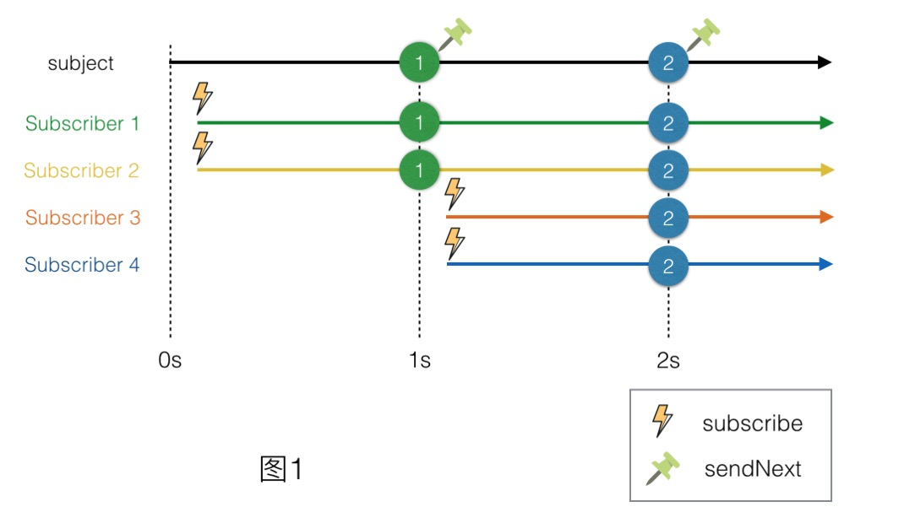
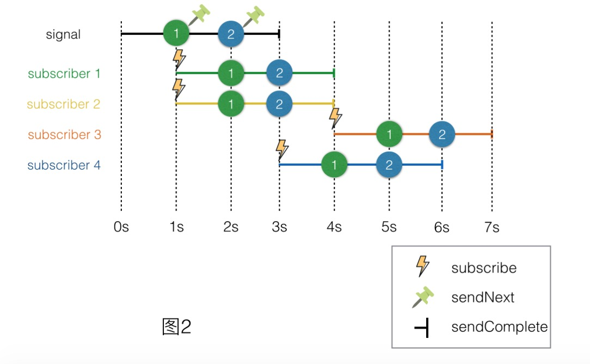
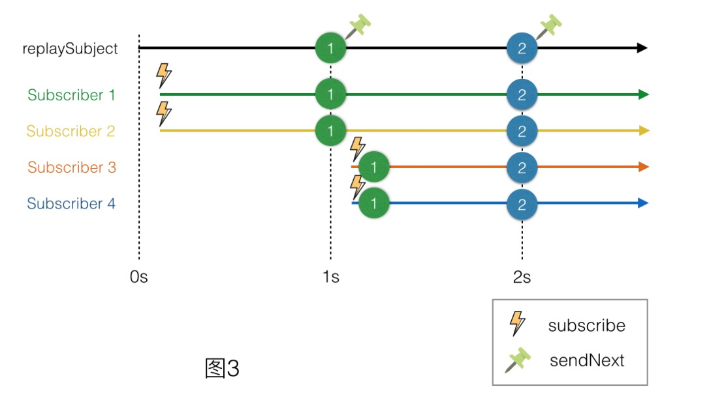
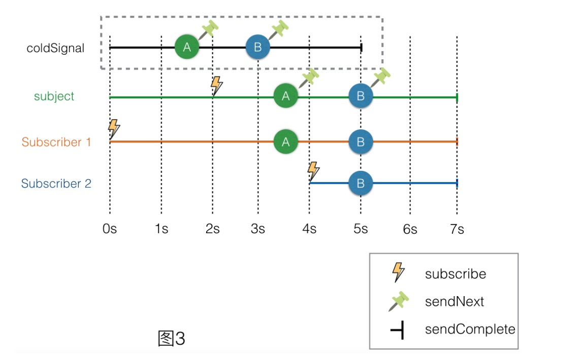

**转自**<https://tech.meituan.com/talk-about-reactivecocoas-cold-signal-and-hot-signal-part-3.html>

第一篇文章中我们介绍了冷信号与热信号的概念，前一篇文章我们也讨论了为什么要区分冷信号与热信号，下面我会先为大家揭晓热信号的本质，再给出冷信号转换成热信号的方法。

## 揭示热信号的本质
在**ReactiveCocoa**中，究竟什么才是热信号呢？冷信号是比较常见的，map一下就会得到一个冷信号。但在RAC中，好像并没有“hot signal”这个单独的说法。原来在RAC的世界中，所有的热信号都属于一个类——RACSubject。接下来我们来看看究竟它为什么这么“神奇”。

在RAC2.5文档的**框架概述**中，有着这样一段描述：

A subject, represented by the RACSubject class, is a signal that can be manually controlled.

Subjects can be thought of as the "mutable" variant of a signal, much like NSMutableArray is for NSArray. They are extremely useful for bridging non-RAC code into the world of signals.

For example, instead of handling application logic in block callbacks, the blocks can simply send events to a shared subject instead. The subject can then be returned as a RACSignal, hiding the implementation detail of the callbacks.

Some subjects offer additional behaviors as well. In particular, RACReplaySubject can be used to buffer events for future subscribers, like when a network request finishes before anything is ready to handle the result.

从这段描述中，我们可以发现Subject具备如下三个特点：

1. Subject是“可变”的。
2. Subject是非RAC到RAC的一个桥梁。
3. Subject可以附加行为，例如`RACReplaySubject`具备为未来订阅者缓冲事件的能力。

从第三个特点来看，Subject具备为未来订阅者缓冲事件的能力，那也就说明它是自身是有状态的。根据上文的介绍，Subject是符合热信号的特点的。为了验证它，我们再来做个简单实验：

    RACSubject *subject = [RACSubject subject];
    RACSubject *replaySubject = [RACReplaySubject subject];

    [[RACScheduler mainThreadScheduler] afterDelay:0.1 schedule:^{
        // Subscriber 1
        [subject subscribeNext:^(id x) {
            NSLog(@"Subscriber 1 get a next value: %@ from subject", x);
        }];
        [replaySubject subscribeNext:^(id x) {
            NSLog(@"Subscriber 1 get a next value: %@ from replay subject", x);
        }];

        // Subscriber 2
        [subject subscribeNext:^(id x) {
            NSLog(@"Subscriber 2 get a next value: %@ from subject", x);
        }];
        [replaySubject subscribeNext:^(id x) {
            NSLog(@"Subscriber 2 get a next value: %@ from replay subject", x);
        }];
    }];

    [[RACScheduler mainThreadScheduler] afterDelay:1 schedule:^{
        [subject sendNext:@"send package 1"];
        [replaySubject sendNext:@"send package 1"];
    }];

    [[RACScheduler mainThreadScheduler] afterDelay:1.1 schedule:^{
        // Subscriber 3
        [subject subscribeNext:^(id x) {
            NSLog(@"Subscriber 3 get a next value: %@ from subject", x);
        }];
        [replaySubject subscribeNext:^(id x) {
            NSLog(@"Subscriber 3 get a next value: %@ from replay subject", x);
        }];

        // Subscriber 4
        [subject subscribeNext:^(id x) {
            NSLog(@"Subscriber 4 get a next value: %@ from subject", x);
        }];
        [replaySubject subscribeNext:^(id x) {
            NSLog(@"Subscriber 4 get a next value: %@ from replay subject", x);
        }];
    }];

    [[RACScheduler mainThreadScheduler] afterDelay:2 schedule:^{
        [subject sendNext:@"send package 2"];
        [replaySubject sendNext:@"send package 2"];
    }];
按照时间线来解读一下上述代码：

1. 0s时创建subject与replaySubject这两个subject。
2. 0.1s时Subscriber 1分别订阅了subject与replaySubject。
3. 0.1s时Subscriber 2也分别订阅了subject与replaySubject。
4. 1s时分别向subject与replaySubject发送了"send package 1"这个字符串作为值。
5. 1.1s时Subscriber 3分别订阅了subject与replaySubject。
6. 1.1s时Subscriber 4也分别订阅了subject与replaySubject。
7. 2s时再分别向subject与replaySubject发送了"send package 2"这个字符串作为值。

接下来看一下输出的结果：

	2015-09-28 13:35:22.855 RACDemos[13646:1269269] Start
	2015-09-28 13:35:23.856 RACDemos[13646:1269269] Subscriber 1 get a next value: send package 1 from subject
	2015-09-28 13:35:23.856 RACDemos[13646:1269269] Subscriber 2 get a next value: send package 1 from subject
	2015-09-28 13:35:23.857 RACDemos[13646:1269269] Subscriber 1 get a next value: send package 1 from replay subject
	2015-09-28 13:35:23.857 RACDemos[13646:1269269] Subscriber 2 get a next value: send package 1 from replay subject
	2015-09-28 13:35:24.059 RACDemos[13646:1269269] Subscriber 3 get a next value: send package 1 from replay subject
	2015-09-28 13:35:24.059 RACDemos[13646:1269269] Subscriber 4 get a next value: send package 1 from replay subject
	2015-09-28 13:35:25.039 RACDemos[13646:1269269] Subscriber 1 get a next value: send package 2 from subject
	2015-09-28 13:35:25.039 RACDemos[13646:1269269] Subscriber 2 get a next value: send package 2 from subject
	2015-09-28 13:35:25.039 RACDemos[13646:1269269] Subscriber 3 get a next value: send package 2 from subject
	2015-09-28 13:35:25.040 RACDemos[13646:1269269] Subscriber 4 get a next value: send package 2 from subject
	2015-09-28 13:35:25.040 RACDemos[13646:1269269] Subscriber 1 get a next value: send package 2 from replay subject
	2015-09-28 13:35:25.040 RACDemos[13646:1269269] Subscriber 2 get a next value: send package 2 from replay subject
	2015-09-28 13:35:25.040 RACDemos[13646:1269269] Subscriber 3 get a next value: send package 2 from replay subject
	2015-09-28 13:35:25.040 RACDemos[13646:1269269] Subscriber 4 get a next value: send package 2 from replay subject
	
结合结果可以分析出如下内容：

1. 22.855s时，测试启动，subject与replaySubject创建完毕。
2. 23.856s时，距离启动大约1s后，Subscriber 1和Subscriber 2同时从subject接收到了"send package 1"这个值。
3. 23.857s时，也是距离启动大约1s后，Subscriber 1和Subscriber 2同时从replaySubject接收到了"send package 1"这个值。
4. 24.059s时，距离启动大约1.2s后，Subscriber 3和Subscriber 4同时从replaySubject接收到了"send package 1"这个值。注意Subscriber 3和Subscriber 4并没有从subject接收"send package 1"这个值。
5. 25.039s时，距离启动大约2.1s后，Subscriber 1、Subscriber 2、Subscriber 3、Subscriber 4同时从subject接收到了"send package 2"这个值。
6. 25.040s时，距离启动大约2.1s后，Subscriber 1、Subscriber 2、Subscriber 3、Subscriber 4同时从replaySubject接收到了"send package 2"这个值。

只关注subject，根据时间线，我们可以得到下图：

经过观察不难发现，4个订阅者实际上是共享subject的，一旦这个subject发送了值，当前的订阅者就会同时接收到。由于Subscriber 3与Subscriber 4的订阅时间稍晚，所以错过了第一次值的发送。这与冷信号是截然不同的反应。冷信号的图类似下图：

对比上面两张图，是不是可以发现，subject类似“直播”，错过了就不再处理。而signal类似“点播”，每次订阅都会从头开始。所以我们有理由认定subject天然就是热信号。

下面再来看看replaySubject，根据时间线，我们能得到另一张图：

将图3与图1对比会发现，Subscriber 3与Subscriber 4在订阅后马上接收到了“历史值”。对于Subscriber 3和Subscriber 4来说，它们只关心“历史的值”而不关心“历史的时间线”，因为实际上1与2是间隔1s发送的，但是它们接收到的显然不是。举个生动的例子，就好像科幻电影里面主人公穿越时间线后会先把所有的回忆快速闪过再来到现实一样。（见《X战警：逆转未来》、《蝴蝶效应》）所以我们也有理由认定replaySubject天然也是热信号。

看到这里，我们终于揭开了热信号的面纱，结论就是：

1. RACSubject及其子类是热信号。
2. RACSignal排除RACSubject类以外的是冷信号。

### 如何将一个冷信号转化成热信号——广播
冷信号与热信号的本质区别在于是否保持状态，冷信号的多次订阅是不保持状态的，而热信号的多次订阅可以保持状态。所以一种将冷信号转换为热信号的方法就是，将冷信号订阅，订阅到的每一个时间通过RACSbuject发送出去，其他订阅者只订阅这个RACSubject。

观察下面的代码：

    RACSignal *coldSignal = [RACSignal createSignal:^RACDisposable *(id<RACSubscriber> subscriber) {
        NSLog(@"Cold signal be subscribed.");
        [[RACScheduler mainThreadScheduler] afterDelay:1.5 schedule:^{
            [subscriber sendNext:@"A"];
        }];

        [[RACScheduler mainThreadScheduler] afterDelay:3 schedule:^{
            [subscriber sendNext:@"B"];
        }];

        [[RACScheduler mainThreadScheduler] afterDelay:5 schedule:^{
            [subscriber sendCompleted];
        }];

        return nil;
    }];

    RACSubject *subject = [RACSubject subject];
    NSLog(@"Subject created.");

    [[RACScheduler mainThreadScheduler] afterDelay:2 schedule:^{
        [coldSignal subscribe:subject];
    }];

    [subject subscribeNext:^(id x) {
        NSLog(@"Subscriber 1 recieve value:%@.", x);
    }];

    [[RACScheduler mainThreadScheduler] afterDelay:4 schedule:^{
        [subject subscribeNext:^(id x) {
            NSLog(@"Subscriber 2 recieve value:%@.", x);
        }];
执行顺序是这样的：

1. 创建一个冷信号：coldSignal。该信号声明了“订阅后1.5秒发送‘A’，3秒发送'B'，5秒发送完成事件”。
2. 创建一个RACSubject：subject。
3. 在2秒后使用这个subject订阅coldSignal。
4. 立即订阅这个subject。
5. 4秒后订阅这个subject。

如果所料不错的话，通过订阅这个subject并不会引起coldSignal重复执行block的内容。我们来看下结果：

	2015-09-28 19:36:45.703 RACDemos[14110:1556061] Subject created.
	2015-09-28 19:36:47.705 RACDemos[14110:1556061] Cold signal be subscribed.
	2015-09-28 19:36:49.331 RACDemos[14110:1556061] Subscriber 1 recieve value:A.
	2015-09-28 19:36:50.999 RACDemos[14110:1556061] Subscriber 1 recieve value:B.
	2015-09-28 19:36:50.999 RACDemos[14110:1556061] Subscriber 2 recieve value:B.
参考时间线，会得到下图：

不难发现其中的几个重点：

1. subject是从一开始就创建好的，等到2s后便开始订阅coldSignal。
2. Subscriber 1是subject创建后就开始订阅的，但是第一个接收时间与subject接收coldSignal第一个值的时间是一样的。
3. Subscriber 2是subject创建4s后开始订阅的，所以只能接收到第二个值。

通过观察可以确定，subject就是coldSignal转化的热信号。所以使用RACSubject来将冷信号转化为热信号是可行的。

当然，使用这种RACSubject来订阅冷信号得到热信号的方式仍有一些小的瑕疵。例如subject的订阅者提前终止了订阅，而subject并不能终止对coldSignal的订阅。（RACDisposable是一个比较大的话题，我计划在其他的文章中详细阐述它，也希望感兴趣的同学自己来理解。）所以在RAC库中对于冷信号转化成热信号有如下标准的封装：

	- (RACMulticastConnection *)publish;
	- (RACMulticastConnection *)multicast:(RACSubject *)subject;
	- (RACSignal *)replay;
	- (RACSignal *)replayLast;
	- (RACSignal *)replayLazily;
	
这5个方法中，最为重要的就是- (RACMulticastConnection *)multicast:(RACSubject *)subject;这个方法了，其他几个方法也是间接调用它的。我们来看看它的实现：

	/// implementation RACSignal (Operations)
	- (RACMulticastConnection *)multicast:(RACSubject *)subject {
	    [subject setNameWithFormat:@"[%@] -multicast: %@", self.name, subject.name];
	    RACMulticastConnection *connection = [[RACMulticastConnection alloc] initWithSourceSignal:self subject:subject];
	    return connection;
	}
	
	/// implementation RACMulticastConnection
	
	- (id)initWithSourceSignal:(RACSignal *)source subject:(RACSubject *)subject {
	    NSCParameterAssert(source != nil);
	    NSCParameterAssert(subject != nil);
	
	    self = [super init];
	    if (self == nil) return nil;
	
	    _sourceSignal = source;
	    _serialDisposable = [[RACSerialDisposable alloc] init];
	    _signal = subject;
	
	    return self;
	}
	
	#pragma mark Connecting
	
	- (RACDisposable *)connect {
	    BOOL shouldConnect = OSAtomicCompareAndSwap32Barrier(0, 1, &_hasConnected);
	
	    if (shouldConnect) {
	        self.serialDisposable.disposable = [self.sourceSignal subscribe:_signal];
	    }
	
	    return self.serialDisposable;
	}
	
	- (RACSignal *)autoconnect {
	    __block volatile int32_t subscriberCount = 0;
	
	    return [[RACSignal
	        createSignal:^(id<RACSubscriber> subscriber) {
	            OSAtomicIncrement32Barrier(&subscriberCount);
	
	            RACDisposable *subscriptionDisposable = [self.signal subscribe:subscriber];
	            RACDisposable *connectionDisposable = [self connect];
	
	            return [RACDisposable disposableWithBlock:^{
	                [subscriptionDisposable dispose];
	
	                if (OSAtomicDecrement32Barrier(&subscriberCount) == 0) {
	                    [connectionDisposable dispose];
	                }
	            }];
	        }]
	        setNameWithFormat:@"[%@] -autoconnect", self.signal.name];
	}
虽然代码比较短但不是很好懂，大概来说明一下：

1. 当RACSignal类的实例调用- (RACMulticastConnection *)multicast:(RACSubject *)subject时，以self和subject作为构造参数创建一个RACMulticastConnection实例。
2. RACMulticastConnection构造的时候，保存source和subject作为成员变量，创建一个RACSerialDisposable对象，用于取消订阅。
3. 当RACMulticastConnection类的实例调用- (RACDisposable *)connect这个方法的时候，判断是否是第一次。如果是的话用_signal这个成员变量来订阅sourceSignal之后返回self.serialDisposable；否则直接返回self.serialDisposable。这里面订阅sourceSignal是重点。
4. RACMulticastConnection的signal只读属性，就是一个热信号，订阅这个热信号就避免了各种副作用的问题。它会在- (RACDisposable *)connect第一次调用后，根据sourceSignal的订阅结果来传递事件。
5. 想要确保第一次订阅就能成功订阅sourceSignal，可以使用- (RACSignal *)autoconnect这个方法，它保证了第一个订阅者触发sourceSignal的订阅，也保证了当返回的信号所有订阅者都关闭连接后sourceSignal被正确关闭连接。

由于RAC是一个线程安全的框架，所以好奇的同学可以了解下“OSAtomic*”这一系列的原子操作。抛开这些应该不难理解上述代码。

了解源码之后，这个方法的正确使用就清楚了，应该像这样：

    RACSignal *coldSignal = [RACSignal createSignal:^RACDisposable *(id<RACSubscriber> subscriber) {
        NSLog(@"Cold signal be subscribed.");
        [[RACScheduler mainThreadScheduler] afterDelay:1.5 schedule:^{
            [subscriber sendNext:@"A"];
        }];

        [[RACScheduler mainThreadScheduler] afterDelay:3 schedule:^{
            [subscriber sendNext:@"B"];
        }];

        [[RACScheduler mainThreadScheduler] afterDelay:5 schedule:^{
            [subscriber sendCompleted];
        }];

        return nil;
    }];

    RACSubject *subject = [RACSubject subject];
    NSLog(@"Subject created.");

    RACMulticastConnection *multicastConnection = [coldSignal multicast:subject];
    RACSignal *hotSignal = multicastConnection.signal;

    [[RACScheduler mainThreadScheduler] afterDelay:2 schedule:^{
        [multicastConnection connect];
    }];

    [hotSignal subscribeNext:^(id x) {
        NSLog(@"Subscribe 1 recieve value:%@.", x);
    }];

    [[RACScheduler mainThreadScheduler] afterDelay:4 schedule:^{
        [hotSignal subscribeNext:^(id x) {
            NSLog(@"Subscribe 2 recieve value:%@.", x);
        }];
    }];
或者这样：

    RACSignal *coldSignal = [RACSignal createSignal:^RACDisposable *(id<RACSubscriber> subscriber) {
        NSLog(@"Cold signal be subscribed.");
        [[RACScheduler mainThreadScheduler] afterDelay:1.5 schedule:^{
            [subscriber sendNext:@"A"];
        }];

        [[RACScheduler mainThreadScheduler] afterDelay:3 schedule:^{
            [subscriber sendNext:@"B"];
        }];

        [[RACScheduler mainThreadScheduler] afterDelay:5 schedule:^{
            [subscriber sendCompleted];
        }];

        return nil;
    }];

    RACSubject *subject = [RACSubject subject];
    NSLog(@"Subject created.");

    RACMulticastConnection *multicastConnection = [coldSignal multicast:subject];
    RACSignal *hotSignal = multicastConnection.autoconnect;

    [[RACScheduler mainThreadScheduler] afterDelay:2 schedule:^{
        [hotSignal subscribeNext:^(id x) {
            NSLog(@"Subscribe 1 recieve value:%@.", x);
        }];
    }];

    [[RACScheduler mainThreadScheduler] afterDelay:4 schedule:^{
        [hotSignal subscribeNext:^(id x) {
            NSLog(@"Subscribe 2 recieve value:%@.", x);
        }];
    }];
以上的两种写法和之前用Subject来传递的例子都可以得到相同的结果。

下面再来看看其他几个方法的实现：

	/// implementation RACSignal (Operations)
	- (RACMulticastConnection *)publish {
	    RACSubject *subject = [[RACSubject subject] setNameWithFormat:@"[%@] -publish", self.name];
	    RACMulticastConnection *connection = [self multicast:subject];
	    return connection;
	}
	
	- (RACSignal *)replay {
	    RACReplaySubject *subject = [[RACReplaySubject subject] setNameWithFormat:@"[%@] -replay", self.name];
	
	    RACMulticastConnection *connection = [self multicast:subject];
	    [connection connect];
	
	    return connection.signal;
	}
	
	- (RACSignal *)replayLast {
	    RACReplaySubject *subject = [[RACReplaySubject replaySubjectWithCapacity:1] setNameWithFormat:@"[%@] -replayLast", self.name];
	
	    RACMulticastConnection *connection = [self multicast:subject];
	    [connection connect];
	
	    return connection.signal;
	}
	
	- (RACSignal *)replayLazily {
	    RACMulticastConnection *connection = [self multicast:[RACReplaySubject subject]];
	    return [[RACSignal
	        defer:^{
	            [connection connect];
	            return connection.signal;
	        }]
	        setNameWithFormat:@"[%@] -replayLazily", self.name];
	}
这几个方法的实现都相当简单，只是为了简化而封装，具体说明一下：

1. - (RACMulticastConnection *)publish就是帮忙创建了RACSubject。
2. - (RACSignal *)replay就是用RACReplaySubject来作为subject，并立即执行connect操作，返回connection.signal。其作用是上面提到的replay功能，即后来的订阅者可以收到历史值。
3. - (RACSignal *)replayLast就是用Capacity为1的RACReplaySubject来替换- (RACSignal *)replay的`subject。其作用是使后来订阅者只收到最后的历史值。
4. - (RACSignal *)replayLazily和- (RACSignal *)replay的区别就是replayLazily会在第一次订阅的时候才订阅sourceSignal。

所以，其实本质仍然是

>使用一个Subject来订阅原始信号，并让其他订阅者订阅这个Subject，这个Subject就是热信号。

现在再回过来看下之前系列文章第二篇中那个业务场景的例子，其实修改的方法很简单，就是在网络获取的fetchData这个信号后面，增加一个replayLazily变换，就不会出现网络请求重发6次的问题了。

修改后的代码如下，大家可以试试：

    self.sessionManager = [[AFHTTPSessionManager alloc] initWithBaseURL:[NSURL URLWithString:@"http://api.xxxx.com"]];

    self.sessionManager.requestSerializer = [AFJSONRequestSerializer serializer];
    self.sessionManager.responseSerializer = [AFJSONResponseSerializer serializer];

    @weakify(self)
    RACSignal *fetchData = [[RACSignal createSignal:^RACDisposable *(id<RACSubscriber> subscriber) {
        @strongify(self)
        NSURLSessionDataTask *task = [self.sessionManager GET:@"fetchData" parameters:@{@"someParameter": @"someValue"} success:^(NSURLSessionDataTask *task, id responseObject) {
            [subscriber sendNext:responseObject];
            [subscriber sendCompleted];
        } failure:^(NSURLSessionDataTask *task, NSError *error) {
            [subscriber sendError:error];
        }];
        return [RACDisposable disposableWithBlock:^{
            if (task.state != NSURLSessionTaskStateCompleted) {
                [task cancel];
            }
        }];
    }] replayLazily];  // modify here!!

    RACSignal *title = [fetchData flattenMap:^RACSignal *(NSDictionary *value) {
        if ([value[@"title"] isKindOfClass:[NSString class]]) {
            return [RACSignal return:value[@"title"]];
        } else {
            return [RACSignal error:[NSError errorWithDomain:@"some error" code:400 userInfo:@{@"originData": value}]];
        }
    }];

    RACSignal *desc = [fetchData flattenMap:^RACSignal *(NSDictionary *value) {
        if ([value[@"desc"] isKindOfClass:[NSString class]]) {
            return [RACSignal return:value[@"desc"]];
        } else {
            return [RACSignal error:[NSError errorWithDomain:@"some error" code:400 userInfo:@{@"originData": value}]];
        }
    }];

    RACSignal *renderedDesc = [desc flattenMap:^RACStream *(NSString *value) {
        NSError *error = nil;
        RenderManager *renderManager = [[RenderManager alloc] init];
        NSAttributedString *rendered = [renderManager renderText:value error:&error];
        if (error) {
            return [RACSignal error:error];
        } else {
            return [RACSignal return:rendered];
        }
    }];

    RAC(self.someLablel, text) = [[title catchTo:[RACSignal return:@"Error"]]  startWith:@"Loading..."];
    RAC(self.originTextView, text) = [[desc catchTo:[RACSignal return:@"Error"]] startWith:@"Loading..."];
    RAC(self.renderedTextView, attributedText) = [[renderedDesc catchTo:[RACSignal return:[[NSAttributedString alloc] initWithString:@"Error"]]] startWith:[[NSAttributedString alloc] initWithString:@"Loading..."]];

    [[RACSignal merge:@[title, desc, renderedDesc]] subscribeError:^(NSError *error) {
        UIAlertView *alertView = [[UIAlertView alloc] initWithTitle:@"Error" message:error.domain delegate:nil cancelButtonTitle:@"OK" otherButtonTitles:nil];
        [alertView show];
    }];
当然，细心的同学会发现这样修改，仍然有许多计算上的浪费，例如将fetchData转换为title的block会执行多次，将fetchData转换为desc的block也会执行多次。但是由于这些block都是无副作用的，计算量并不大，可以忽略不计。如果计算量大的，也需要对中间的信号进行热信号的转换。不过请不要忽略冷热信号的转换本身也是有计算代价的。

好的，写到这里，我们终于揭开RAC中冷信号与热信号的全部面纱，也知道如何使用了。希望这个系列文章可以让大家更好地了解RAC，避免使用RAC遇到的误区。谢谢大家。

